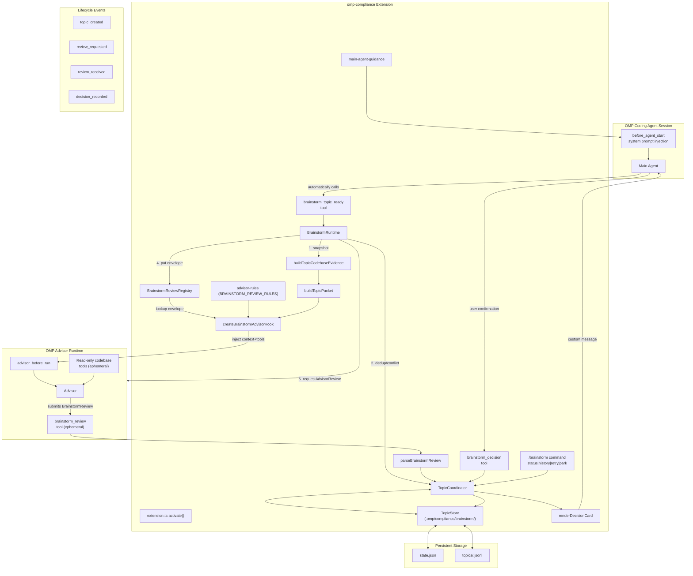

# Advisor Brainstorm Extension — Workflow Guide

This document describes how the `@bearmaxdd/omp-compliance` extension's Brainstorm
subsystem works, from topic creation through independent advisor review to
final user decision. The Brainstorm feature lets the main agent submit
converged design/architecture/scope/contract/migration/risk decisions to the
dedicated OMP Advisor for an independent critical review.

---

## Table of Contents

- [Concept and Purpose](#concept-and-purpose)
- [Workflow Overview](#workflow-overview)
- [Topic Lifecycle States](#topic-lifecycle-states)
- [Main Agent Guidance](#main-agent-guidance)
- [/brainstorm Command Reference](#brainstorm-command-reference)
- [brainstorm_topic_ready Tool Reference](#brainstorm_topic_ready-tool-reference)
- [brainstorm_decision Tool Reference](#brainstorm_decision-tool-reference)
- [Advisor Review Process](#advisor-review-process)
- [Decision Card Rendering](#decision-card-rendering)
- [Lazy Initialization](#lazy-initialization)
- [Architecture Diagram](#architecture-diagram)
- [Quality Gates Checklist](#quality-gates-checklist)
- [Reference](#reference)

---

## Concept and Purpose

Brainstorm (`/brainstorm`) is a subsystem within the OMP Compliance extension
that provides **independent adversarial review** for substantive conversational
decisions. When the main agent and user have converged on a meaningful
engineering decision — architecture choice, implementation route, migration
strategy, scope definition, contract design, or risk assessment — the agent
calls `brainstorm_topic_ready` to trigger a dedicated Advisor review.

**Key principles:**

- **Independent review, not rubber-stamping.** The Advisor is instructed to
  act as a critical reviewer: identify gaps, raise counterexamples, flag
  overlooked constraint violations, propose viable alternatives.
- **User decides.** The Advisor never issues `pass`/`remediate` verdicts.
  It produces structured reviews (`support`, `challenge`, or
  `insufficient_evidence`) and the user makes the final call.
- **Isolated from compliance.** Brainstorm operates on its own state machine,
  store, and review protocol. It shares no types or logic with the Compliance
  `pass`/`remediate`/`stalled` cycle.
- **Deterministic deduplication.** Identical topic inputs (same normalized
  fields + same codebase evidence references) produce the same SHA-256
  fingerprint and are reused — no duplicate advisor calls.
- **Serial processing.** Only one topic can be mid-review at a time. A
  conflicting submission returns the active topic ID.

### What it is NOT

- Not a compliance completion gate — no `compliance_complete`, no TDD contract.
- Not a general-purpose question-answering tool — only for substantive,
  converged decisions.
- Not an auto-decider — `user_confirmed: true` is always required.
- Not a tool that survives across sessions — topics are serialised to disk.

---

## Workflow Overview

The brainstorm workflow proceeds through seven phases:

### 1. Discussion (drafting)

The main agent and user discuss a design/architecture/scope/etc. decision.
The agent records constraints, success criteria, and unresolved questions
as part of the conversation.

### 2. Convergence (ready_for_advisor_review)

When the conversation converges on a well-formed candidate decision, the
main agent calls `brainstorm_topic_ready` with:

- `topic_kind` — the category (architecture, scope, contract, etc.)
- `title` — short descriptive title (max 200 chars)
- `candidate_decision` — the main conclusion (max 4,000 chars)
- `constraints`, `success_criteria`, `unresolved_questions` — optional (max 30 items each)
- `codebase_relevance` — "required", "optional", or "none"
- `discussion_summary` — free-text context (max 8,000 chars)

The `BrainstormRuntime.submitTopic()` method:

1. Collects a tool-event evidence snapshot from the `CollectorRuntime`.
2. Delegates to `TopicCoordinator.submit()` for dedup/conflict detection.
3. Builds codebase evidence and a bounded topic packet (max 16,000 chars).
4. Registers a review envelope in the `BrainstormReviewRegistry`.
5. Requests an advisor review via the `brainstorm_review` trigger.

### 3. Advisor Review (advisor_reviewing)

The OMP `AdvisorRuntime` picks up the queued review with trigger
`brainstorm_review`. The `createBrainstormAdvisorHook()` handler:

1. Looks up the matching envelope in the registry.
2. Injects the topic context (packet) and advisor rules as system context.
3. Adds read-only codebase-memory tools (from the agent's session) that match
   the brainstorm white-list.
4. Registers the `brainstorm_review` tool for the Advisor to submit its
   structured review.

### 4. Advisor Submits Review (awaiting_user_decision)

The Advisor calls `brainstorm_review` with the structured `BrainstormReview`:

- `status`: `support` | `challenge` | `insufficient_evidence`
- `findings`: list of categorized findings (risk, assumption, scope, etc.)
- `alternatives`: proposed alternative approaches with tradeoffs
- `summary`: natural-language summary
- `recommendation`: the Advisor's recommended path
- `confidence`: high | medium | low

The tool validates identity fields (`topic_id`, `input_hash`) against the
envelope, passes to `coordinator.acceptReview()`, and renders a **decision
card** to the user.

After submission, the envelope is consumed (at-most-once guarantee).

### 5. Decision (decided / parked / reopened)

The main agent presents the decision card to the user and asks for explicit
confirmation. The agent calls `brainstorm_decision` with:

- `topic_id` — the topic being decided
- `decision` — one of `accept_candidate`, `accept_alternative`, `reopen`,
  `park`
- `selected_alternative` — required when decision is `accept_alternative`
- `rationale` — optional free-text (max 4,000 chars)
- `user_confirmed: true` — **required**, enforced at validation layer

### 6. Remediation or Retry

If the Advisor review comes back `review_unavailable` (advisor rejected,
timed out, or model unavailable):

- The main agent can call `/brainstorm retry <topic_id>` to reset to
  `drafting` for re-submission.
- If the user chooses `reopen`, the topic transitions back to `drafting`
  with the attempt counter incremented. The previous review and decision
  are cleared.

### 7. Park or Complete

A `park` decision records the decision without deleting history and
transitions to `parked` (terminal). The topic can still be retried later
via the command.

---

## Topic Lifecycle States

```
drafting ──→ ready_for_advisor_review ──→ advisor_reviewing
                                                │
                                          ┌─────┴──────┐
                                          ▼             ▼
                                  awaiting_user_decision  review_unavailable
                                          │                  │
                               ┌──────────┼──────┐           │
                               ▼          ▼      ▼           │
                            decided  parked  drafting◄────────┘
                              (T)       (T)
```

| Status | Meaning | Terminal |
|--------|---------|----------|
| `drafting` | Topic being discussed, not yet submitted for review | No |
| `ready_for_advisor_review` | Input finalized, queued for advisor review | No |
| `advisor_reviewing` | Advisor has accepted and is reviewing the topic | No |
| `awaiting_user_decision` | Advisor review complete, waiting for user's explicit decision | No |
| `review_unavailable` | Advisor rejected or review request failed — retry available | No |
| `decided` | User accepted candidate or alternative | Yes |
| `parked` | User parked topic for later processing | Yes |

### Valid Transitions (enforced by TopicCoordinator)

| Source | Allowed Targets |
|--------|-----------------|
| drafting | ready_for_advisor_review |
| ready_for_advisor_review | advisor_reviewing |
| advisor_reviewing | awaiting_user_decision, review_unavailable |
| review_unavailable | awaiting_user_decision, drafting |
| awaiting_user_decision | decided, parked, drafting |

### Conflict Detection

`TopicCoordinator` considers a topic "waiting for review" when its status
is one of:
- `ready_for_advisor_review`
- `advisor_reviewing`
- `review_unavailable`

If another (different) topic is already in one of these states, a new
submission returns `conflict`. Identical-fingerprint submissions bypass
this check (reused).

---

## Main Agent Guidance

On every agent start, the extension injects a system prompt section via
`appendBrainstormGuidance()`. This guidance tells the main agent:

- When to call `brainstorm_topic_ready` (only for substantive, converged
  decisions — not wording, clarification, or factual lookup)
- What fields the tool accepts
- That the advisor will independently challenge the decision

The guidance is appended before each agent start via the
`before_agent_start` event hook.

---

## /brainstorm Command Reference

The `/brainstorm` command is registered on the extension API. It supports
four subcommands:

| Subcommand | Arguments | Description |
|------------|-----------|-------------|
| `status` | — | Show current topic state (read-only) |
| `history` | `<topic_id>` | Show chronological event history (read-only) |
| `retry` | `<topic_id>` | Reset a `review_unavailable` topic to `drafting` |
| `park` | `<topic_id>` | Park a topic from `awaiting_user_decision` |

### `/brainstorm status`

Displays a read-only projection of the current topic:

```
==================================================
Brainstorm 专题状态
==================================================
专题 ID:   topic-550e8400-e29b-41d4-a716-446655440000
标题:      Adopt layered architecture for auth service
类别:      architecture
状态:      awaiting_user_decision
尝试次数:  1
--------------------------------------------------
```

No side effects — never modifies state.

### `/brainstorm history <topic_id>`

Displays a chronological list of all events for a specific topic:

```
==================================================
专题事件历史: topic-550e8400-e29b-41d4-a716-446655440000
==================================================
[2026-07-13T10:00:00.000Z] topic_created (attempt: 1)
[2026-07-13T10:00:01.000Z] review_requested (reviewId: "br-...")
[2026-07-13T10:01:00.000Z] review_received (reviewStatus: "challenge")
[2026-07-13T10:02:00.000Z] decision_recorded (decision: "accept_candidate")
--------------------------------------------------
```

Event types: `topic_created`, `review_requested`, `review_received`,
`review_unavailable`, `decision_recorded`, `topic_reopened`, `topic_parked`.

### `/brainstorm retry <topic_id>`

Only valid when the current topic status is `review_unavailable`. Chains
two transitions:

1. `review_unavailable` → `awaiting_user_decision` (via `acceptReview`
   with a placeholder review)
2. `awaiting_user_decision` → `drafting` (via `recordDecision` with
   `reopen`)

The attempt counter increments, and the previous review/decision is cleared
so the topic can be re-submitted.

Throws if the topic is not the current active topic or if the status is not
`review_unavailable`.

### `/brainstorm park <topic_id>`

Only valid when the current topic status is `awaiting_user_decision`.
Records a `park` decision via `coordinator.recordDecision()` with
rationale "用户暂存". Transitions to `parked` (terminal).

---

## brainstorm_topic_ready Tool Reference

Registered as `brainstorm_topic_ready`. Called by the main agent when a
brainstorm topic has converged on a substantive candidate decision.

### Parameters

| Field | Type | Required | Constraints |
|-------|------|----------|-------------|
| `topic_kind` | string | Yes | One of: `architecture`, `scope`, `contract`, `migration`, `risk`, `implementation_route` |
| `title` | string | Yes | Max 200 chars |
| `candidate_decision` | string | Yes | Max 4,000 chars |
| `constraints` | string[] | No | Max 30 items |
| `success_criteria` | string[] | No | Max 30 items |
| `unresolved_questions` | string[] | No | Max 30 items |
| `codebase_relevance` | string | No | Default: `"none"`. One of: `"required"`, `"optional"`, `"none"` |
| `discussion_summary` | string | No | Max 8,000 chars |

### Result

Returns a `BrainstormSubmitTopicResult`:

```typescript
{
  reviewId?: string;   // Set when a new advisor review was requested
  topic: {             // Full topic state after submission
    topicId: string;
    inputHash: `sha256:${string}`;
    status: string;
    attempt: number;
    input: BrainstormTopicReadyInput;
  };
  status: "advisor_reviewing" | "review_unavailable" | "reused" | "conflict";
}
```

### Validation

The input is validated by `validateTopicReadyInput()`:

- `topic_kind` must be a valid enum value
- `title` must be non-empty, max 200 chars
- `candidate_decision` must be non-empty, max 4,000 chars
- `constraints`, `success_criteria`, `unresolved_questions` must be arrays of strings, max 30 items each
- `codebase_relevance` must be one of the allowed values
- `discussion_summary` max 8,000 chars

Validation errors are returned as tool error messages — the tool is NOT
registered when the extension is disabled.

### Behavior

1. **New topic** — creates a new `BrainstormTopicState`, builds evidence,
   registers envelope, triggers advisor review → `advisor_reviewing`.
2. **Duplicate** — identical SHA-256 fingerprint detected → returns existing
   topic with `reused` status (no new advisor call).
3. **Conflict** — another topic is mid-review → returns `conflict` with the
   active topic ID.

---

## brainstorm_decision Tool Reference

Registered as `brainstorm_decision`. Called by the main agent when the
user has explicitly chosen a decision outcome.

### Parameters

| Field | Type | Required | Constraints |
|-------|------|----------|-------------|
| `topic_id` | string | Yes | Must match the current topic |
| `decision` | string | Yes | One of: `accept_candidate`, `accept_alternative`, `reopen`, `park` |
| `selected_alternative` | string | Conditionally | Required when `decision` is `accept_alternative` |
| `rationale` | string | No | Max 4,000 chars |
| `user_confirmed` | boolean | **Yes** | Must be `true` — enforced at validation layer |

### Validation

`validateDecisionInput()` enforces:

- `topic_id` is a non-empty string
- `decision` is one of the four valid values
- When `decision` is `accept_alternative`: `selected_alternative` must be
  a non-empty string, max 400 chars
- `rationale` max 4,000 chars
- `user_confirmed` must be `true` (strict equality) — protected by
  validation, not the handler
- No other fields are accepted

### Decision Outcomes

| Decision | New Status | Side Effects |
|----------|-----------|--------------|
| `accept_candidate` | `decided` (terminal) | Records decision with timestamp |
| `accept_alternative` | `decided` (terminal) | Records decision with selected alternative name |
| `park` | `parked` (terminal) | Records decision, history preserved |
| `reopen` | `drafting` | Clears review and decision, increments attempt counter |

### Behavior

The handler:

1. Validates input (including `user_confirmed: true`).
2. Delegates to `TopicCoordinator.recordDecision()`.
3. Appends the corresponding lifecycle event to the JSONL store.
4. Returns a success result to the agent.

---

## Advisor Review Process

### Trigger

When `BrainstormRuntime.submitTopic()` succeeds, it calls
`api.requestAdvisorReview()` with:

```typescript
{
  trigger: "brainstorm_review",
  reviewId: "br-<uuid>",
  metadata: {
    sessionId: "...",
    taskId: `brainstorm-${topic.topicId}`,
    topicId: topic.topicId,
    inputHash: topic.inputHash,
    codebaseRelevance: topic.input.codebase_relevance,
  },
}
```

The OMP `AdvisorRuntime` queues the review with trigger `brainstorm_review`.
It is isolated from `compliance_review` queues and `turn_end` batches.

### Advisor Hook (createBrainstormAdvisorHook)

On `advisor_before_run` with trigger `brainstorm_review`:

1. Looks up the envelope in `BrainstormReviewRegistry` by `reviewId`.
2. Returns `additionalSystemContext` containing the `BRAINSTORM_REVIEW_RULES`
   and the rendered topic packet.
3. Returns `additionalTools` containing one `brainstorm_review` tool bound
   to this specific envelope.
4. Returns `additionalToolNames` — the set of read-only codebase-memory
   tool names available from the session (e.g., `search_graph`,
   `search_code`, `get_code_snippet`, `trace_path`).
5. Returns `metadata: { brainstormReviewId: envelope.reviewId }`.

If no matching envelope exists, returns `undefined` (no intervention).

### brainstorm_review Tool

Registered dynamically inside the Advisor run, bound to the specific
envelope. Parameters match `BrainstormReview`:

| Field | Type | Required | Description |
|-------|------|----------|-------------|
| `schema_version` | number | Yes | Must be `1` |
| `topic_id` | string | Yes | Must match the envelope |
| `input_hash` | string | Yes | Must match the envelope |
| `status` | string | Yes | `support`, `challenge`, or `insufficient_evidence` |
| `summary` | string | Yes | Summarise the evaluation |
| `findings` | array | Yes | List of structured findings |
| `alternatives` | array | Yes | List of alternative approaches |
| `recommendation` | string | Yes | The recommended path forward |
| `confidence` | string | Yes | `high`, `medium`, or `low` |

Each finding has:
- `category`: `risk`, `assumption`, `scope`, `contract`, `migration`, or `feasibility`
- `statement`: the finding description
- `impact`: `high`, `medium`, or `low`
- `evidence_refs` (optional): array of codebase reference strings

Each alternative has:
- `name`: short name
- `description`: full description
- `tradeoffs`: array of strings
- `when_to_choose`: guidance on when this alternative is appropriate

On successful submission:

1. `parseBrainstormReview()` validates the review against the expected
   topic context (topic_id, input_hash).
2. `coordinator.acceptReview()` transitions to `awaiting_user_decision`.
3. The envelope is consumed from the registry (at-most-once).
4. A `brainstorm_review` custom message containing the rendered decision
   card is sent to the user via `api.sendMessage`.

### Advisor Rules

The `BRAINSTORM_REVIEW_RULES` XML block instructs the Advisor:

```
<brainstorm-review-rules>
You are acting as an independent reviewer on a brainstorm topic.
Your task is to evaluate the candidate decision critically.

Rules:
1. Independently examine the candidate decision. Do not just restate
   the user's position or the main agent's conclusion — identify gaps,
   risks, and alternatives.
2. Prioritise pointing out concrete counterexamples, overlooked
   constraints, migration/contract risks, and viable alternative
   approaches.
3. For code-related topics, verify claims against actual codebase
   evidence using read-only tools. Do not assume code structure.
4. Use "insufficient_evidence" status when the topic input lacks the
   necessary detail or evidence to form a confident review. Explain
   what is missing.
5. Submit your structured review using the "brainstorm_review" tool.
   You may also use "advise" for supplementary natural-language notes,
   but "advise" does not replace the structured review.
6. You do NOT make the final decision. The user decides. Your role
   is to inform that decision with an independent analysis.

Allowed tools: read, grep, glob, advise, the dynamically available
codebase read-only tools, and brainstorm_review.
</brainstorm-review-rules>
```

### Read-Only Codebase Tools

The following codebase-memory tool suffixes are recognized as
read-only and may be made available to the Advisor:

- `index_status`
- `search_graph`
- `search_code`
- `get_code_snippet`
- `trace_path`

`index_repository` is deliberately excluded — it is a write operation.

Deciding which tools are actually available depends on which codebase-memory
MCP tools are registered in the current OMP session and pass the white-list
check. Tools are injected via `additionalToolNames` in the `advisor_before_run`
result.

---

## Decision Card Rendering

When the Advisor submits a review, `renderDecisionCard()` produces a
human-readable summary:

```
============================================================
专题决策卡
============================================================
专题: Adopt layered architecture for auth service
类别: architecture
状态: awaiting_user_decision

── 当前结论 ──
采用分层架构，将认证逻辑、业务逻辑和数据访问分离到独立层。

── 约束条件 ──
  • 必须兼容现有 JWT 令牌格式

── Advisor 评审摘要 ──
The proposed layered architecture introduces surface area...

── Advisor 异议（高优先级）──
  [!] [risk] 分层引入的间接延迟未量化

── Advisor 其他发现 ──
  • [risk] 现有 JWT 验证逻辑不兼容分层边界

── 可选替代方案 ──
  [扁平架构]
    描述: 减少层次，保持模块内聚
    权衡:
      - 耦合增加
    适用场景: 团队规模小，快速迭代

── Advisor 建议 ──
建议对延迟影响做基准测试后再采纳分层方案...

── 决策入口 ──
需要用户明确选择。请使用 brainstorm_decision 工具确认：
  1. accept_candidate — 接受当前候选结论
  2. accept_alternative — 采纳 Advisor 的替代方案
  3. reopen — 重新讨论
  4. park — 暂存，稍后处理

============================================================
```

The card shows:

- **Header**: topic ID, title, kind, current status
- **Current Conclusion**: the candidate decision from input
- **Constraints** (if any)
- **Advisor Review Summary**: the overall evaluation, review status, confidence
- **High-Impact Findings**: sorted first, marked `[!]`
- **Other Findings**: lower-impact observations
- **Alternative Options**: each with description, tradeoffs, and
  when-to-choose guidance
- **Decision Prompt**: the four options for the user
- **Empty state**: if no review is yet available, shows
  "暂无可审查结果。"

The card is sent as a `brainstorm_review` custom type message with
`display: true` and `attribution: "agent"`.

---

## Lazy Initialization

The extension uses lazy initialization for brainstorm infrastructure:

- `TopicStore` and `TopicCoordinator` are created only on first operation
  (first `brainstorm_topic_ready` call, first `/brainstorm` command).
- The `.omp/compliance/brainstorm/` directory is created lazily.
- `activate()` itself creates NO directories and has NO side effects
  beyond registering event handlers and command/tool names.

This is verified by the `brainstorm-compliance-isolation.test.ts` behavior
test — activation creates neither `.omp/compliance/` nor
`.omp/compliance/brainstorm/`.

---

## Architecture Diagram



### Data Flow Sequence

```
Main Agent                    BrainstormRuntime             TopicCoordinator
     │                              │                            │
     │  brainstorm_topic_ready()    │                            │
     │════════════════════════════> │                            │
     │                              │  submit(input, snapshot)   │
     │                              │══════════════════════════> │
     │                              │                            ├─ normalize + fingerprint
     │                              │                            ├─ dedup (fingerprint)
     │                              │                            ├─ conflict check
     │                              │                            ├─ saveState / appendEvent
     │                              │  submitResult (created)    │
     │                              │<══════════════════════════ │
     │                              │
     │                              ├─ buildTopicCodebaseEvidence
     │                              ├─ buildTopicPacket / renderTopicPacket
     │                              ├─ registry.put(envelope)
     │                              ├─ markReviewRequested()
     │                              └─ requestAdvisorReview(trigger: "brainstorm_review")
     │                              │
     │                          [ OMP AdvisorRuntime queues review ]
     │                              │
     │                              │    advisor_before_run
     │                              │    ──────────────────────> createBrainstormAdvisorHook
     │                              │                              ├─ envelope lookup
     │                              │                              ├─ inject rules + context
     │                              │                              ├─ inject brainstorm_review tool
     │                              │                              └─ inject read-only tools
     │                              │
     │                              │    Advisor evaluates topic
     │                              │    ──────────────────────> brainstorm_review tool
     │                              │                              ├─ parseBrainstormReview()
     │                              │                              ├─ coordinator.acceptReview()
     │                              │                              ├─ consume envelope
     │                              │                              └─ renderDecisionCard()
     │                              │    decision card (custom msg)
     │                              │<──────────────────────────────
     │                              │
     │  brainstorm_decision()       │
     │════════════════════════════> │                            ├─ recordDecision()
     │                              │                            │  accept / reopen / park
     │                              │                            └─ saveState / appendEvent
     │                              │
     │  /brainstorm status          │
     │  /brainstorm history <id>    │
     │  /brainstorm retry <id>      │
     │  /brainstorm park <id>       │────> TopicCoordinator
```


## Installation

The brainstorm subsystem is part of the `@bearmaxdd/omp-compliance` extension.
Install the extension using any of the methods below — brainstorm is
automatically available alongside compliance.

### Option 1: Local Development (monorepo checkout)

```bash
git clone <your-omp-custom-repo>
cd omp-custom
bun install
bun --cwd=packages/omp-compliance run build
```

The extension registers itself via the `omp.extensions` field in
`packages/omp-compliance/package.json`.

### Option 2: bun pack (distributable tarball)

```bash
cd omp-custom
bun --cwd=packages/omp-compliance run build
bun pack --cwd=packages/omp-compliance
# Produces bearmaxdd-omp-compliance-0.1.0.tgz
```

Install in your target OMP workspace:

```bash
bun install /path/to/bearmaxdd-omp-compliance-0.1.0.tgz
```

### Option 3: Project-level `.omp/extensions`

Symlink or copy the built extension into your OMP extensions directory:

```bash
ln -s $(pwd)/packages/omp-compliance ~/.oh-my-pi/extensions/omp-compliance
```

Or add the path in OMP settings: `path/to/omp-compliance/dist/extension.js`.

---

## Quality Gates Checklist

This checklist verifies that a brainstorm implementation or integration
meets all requirements.

### Correctness

- [ ] **Trigger isolation**: `brainstorm_review` triggers only brainstorm
  Advisor runs, never compliance reviews.
- [ ] **Dedup**: identical SHA-256 fingerprint (input + codebase references)
  returns `reused` without creating a new advisor call.
- [ ] **Conflict**: submitting a different topic while another is waiting
  for review returns `conflict` with the active topic ID.
- [ ] **State transitions**: all transitions follow the allowed map
  (`TopicCoordinator.TRANSITIONS`).
- [ ] **Decision guard**: `brainstorm_decision` rejects `user_confirmed`
  not strictly `true`.
- [ ] **At-most-once**: `BrainstormReviewRegistry.consume()` returns
  `undefined` on second call for the same reviewId.
- [ ] **Envelope integrity**: `parseBrainstormReview()` rejects
  mismatched `topic_id`, `input_hash`, or compliance identity fields
  (`task_id`, `contract_hash`, `attempt`).
- [ ] **No auto-decide**: `brainstorm_review` status (`support`) cannot
  trigger `decided` — only `brainstorm_decision` transitions to terminal
  states.

### State Management

- [ ] **Persistence**: topic state persisted to `state.json` and events
  appended to `<topicId>.jsonl` on every mutation.
- [ ] **Crash-tolerance**: JSONL writes tolerate truncated last line.
  `state.json` writes use atomic tmp+rename.
- [ ] **Lazy init**: activation creates no directories or state — first
  brainstorm operation creates `.omp/compliance/brainstorm/`.

### Tool Safety

- [ ] **Input validation**: `brainstorm_topic_ready` enforces field types,
  lengths, and enum values before any state mutation.
- [ ] **Decision validation**: `brainstorm_decision` validates topic_id,
  decision enum, and `user_confirmed` before delegation.
- [ ] **No write tools**: Advisor brainstorm runs get read, grep, glob,
  advise, brainstorm_review, and read-only codebase tools — NEVER
  write/edit/bash/task/Git.
- [ ] **Packet bounds**: rendered topic packet is at most 16,000 characters.

### Integration

- [ ] **Compliance isolation**: brainstorm and compliance share no types,
  no state machine transitions, no verdict protocol.
- [ ] **Same extension**: both subsystems co-exist in `@bearmaxdd/omp-compliance`
  with independent lazy initialization.
- [ ] **Event tracking**: every lifecycle transition appends to the
  topic JSONL store (`TopicEvent` union).
- [ ] **Read-only commands**: `/brainstorm status` and
  `/brainstorm history` never modify state.

---

## Reference

### Command Reference

| Command | Arguments | Description |
|---------|-----------|-------------|
| `/brainstorm status` | — | Show current topic state (read-only) |
| `/brainstorm history <topic_id>` | Topic UUID | Show event history (read-only) |
| `/brainstorm retry <topic_id>` | Topic UUID | Reset `review_unavailable` topic to `drafting` |
| `/brainstorm park <topic_id>` | Topic UUID | Park topic from `awaiting_user_decision` |

### Tool Reference

| Tool | Parameters | Description |
|------|-----------|-------------|
| `brainstorm_topic_ready` | `topic_kind`, `title`, `candidate_decision`, optional fields | Submit a converged topic for advisor review |
| `brainstorm_decision` | `topic_id`, `decision`, `user_confirmed`, optional fields | Record user's explicit decision |
| `brainstorm_review` | `schema_version`, `topic_id`, `input_hash`, `status`, `summary`, `findings`, `alternatives`, `recommendation`, `confidence` | Advisor submits structured review (ephemeral, one-shot) |

### Topic Event Types

| Event | Trigger | Description |
|-------|---------|-------------|
| `topic_created` | `TopicCoordinator.submit()` | New topic created and stored |
| `review_requested` | `markReviewRequested()` | Advisor review requested for topic |
| `review_received` | `acceptReview()` | Advisor submitted a structured review |
| `review_unavailable` | `markReviewUnavailable()` | Advisor rejected or request failed |
| `decision_recorded` | `recordDecision()` | User decision persisted |
| `topic_reopened` | `recordDecision("reopen")` | Topic reopened for re-discussion |
| `topic_parked` | `recordDecision("park")` | Topic parked |

### Topic Packet Format

The topic packet rendered for the Advisor uses an XML-safe representation:

```xml
<brainstorm-topic>
  schema_version: 1
  topic_id: topic-<uuid>
  input_hash: sha256:<hash>
  topic_kind: architecture
  title: <short title>
  candidate_decision: <main conclusion>
  constraints:
    - <constraint 1>
    - <constraint 2>
  success_criteria:
    - <criterion 1>
  unresolved_questions:
    - <question 1>
  discussion_summary: <summary>
  codebase_context:
    mode: available
    <reference>
      label: src/auth/service.ts
      source: search
    </reference>
</brainstorm-topic>
```

Maximum size: 16,000 characters. Fields are sorted in a fixed order.
Sensitive patterns (credentials, tokens) are redacted.

### Store Files

- `state.json` — current topic state (atomic tmp+rename writes)
- `topics/<topicId>.jsonl` — append-only event log per topic

Location: `.omp/compliance/brainstorm/` relative to the repo root.
